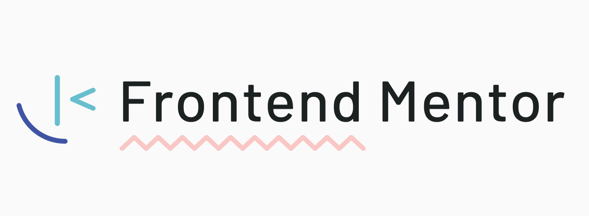

# Frontend Mentor

## Overview

[Frontend Mentor](https://www.frontendmentor.io) is a great platform to keep studying and practicing front-end development, letting you focus on the code itself without worrying about design or UI. It offers a wide variety of projects, from challenges that only require HTML and CSS to full-stack builds, spanning multiple difficulty levels from newbie to advanced.

This makes it easy to test out whatever you're currently studying — whether that's accessibility, Tailwind, TypeScript, or even React and Next.js — and you can make projects as complete and complex as you like, simulating APIs or databases along the way. It's a great playground to sharpen your skills, adaptable to whatever you need at the time.

- [Frontend Mentor Profile](https://www.frontendmentor.io/profile/psudo-dev)

## Projects

#### [Crowdfunding Product Page](https://github.com/psudo-dev/frontend-mentor_-_crowdfunding-product-page)

        

#### [Intro Section with Dropdown Navigation](https://github.com/psudo-dev/frontend-mentor_-_intro-section-with-dropdown-navigation)

      

#### [Expenses Chart Component](https://github.com/psudo-dev/frontend-mentor_-_expenses-chart-component)

       

#### [Interactive Rating Component](https://github.com/psudo-dev/frontend-mentor_-_interactive-rating-component)

       

#### [Bento Grid](https://github.com/psudo-dev/frontend-mentor_-_bento-grid)

   

#### [Fylo Data Storage Component](https://github.com/psudo-dev/frontend-mentor_-_fylo-data-storage-component)

  

#### [Clipboard Landing Page](https://github.com/psudo-dev/frontend-mentor_-_clipboard-landing-page)

   

#### [Testimonials Grid Section](https://github.com/psudo-dev/frontend-mentor_-_testimonials-grid-section)

  

#### [Social Proof Section](https://github.com/psudo-dev/frontend-mentor_-_social-proof-section)

  

## Author

[@psudo-dev](https://github.com/psudo-dev)

## License

This project is licensed under the MIT License - see the [LICENSE.md](./LICENSE.md) file for details
